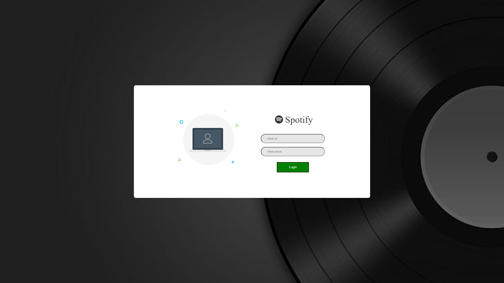
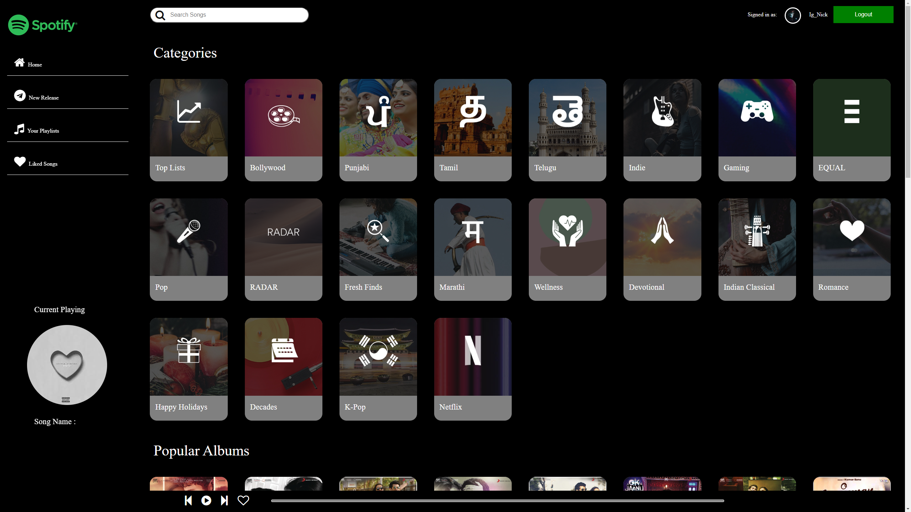
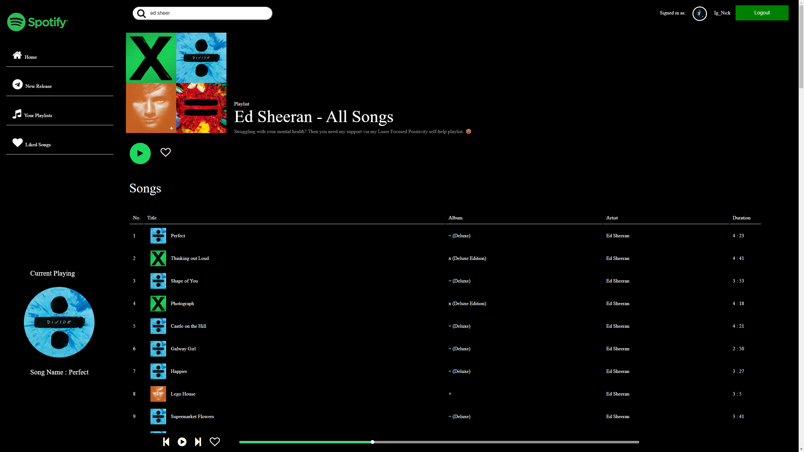
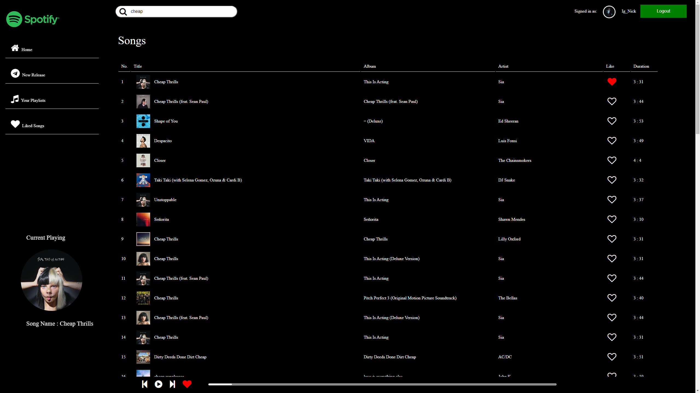

# SPOTIFY WEB CLONE

## Description : 
This is a sample project showing how to call Spotify's API using vanilla JS with the help of NodeJS.

<br>

### Login Page



<br>

### Home Page



<br>

### Playlist Page



<br>

### Search a song



<br>

## Table of contents

* [Features](#features)
* [Installation](#installation)
* [Dependencies](#dependencies)

<br>

## Features :
The library includes helper functions to do the following:


### Fetch music metadata

* Albums, artists, and tracks
* Audio features and analysis for tracks

### Profiles

* User's emails, display name, birthdate, image

### Search

* Albums, tracks, and playlists

### Playlist manipulation

* Get a user's playlists

### Your Music library

* Add, remove, and get tracks and albums that are in the signed in user's Your Music library
* Check if a track or album is in the signed in user's Your Music library 

### Personalization

* Get a user’s top playlists and tracks based on calculated affinity

### Browse

* Get New Releases
* Get Featured Playlists
* Get a List of Categories
* Get a Category
* Get a Category's Playlists


### Follow

* Follow a playlist
* Unfollow a playlist
* Check if users are following a Playlist

<br>

## Installation :

<p>
These project run on Node.js. On its website you can find instructions on how to install it. You can also follow this gist for a quick and easy way to install Node.js and npm.
</p>

Once installed, clone the repository and install its dependencies running:

```md
$ npm install
```

### Using your own credentials
You will need to register your app and get your own credentials from the [Spotify Api Developers Dashboard]().

To do so, go to your Spotify Api Developers Dashboard and create your application. For the examples, we registered this Redirect URI :

http://localhost:9000 (in my case)

Once you have created your app, replace the client_id, client_secret and redirect_uri (in the edit section) in the example with the ones you get from your Application.

In order to run the project, open the folder, and run the following command : 

```md
$ npm run serve
```

Then, open http://localhost:9000 in a browser.
The page will reload if you make edits.
You will also see any lint errors in the console.

<br>

## Dependencies
* NodeJs
* Webpack
* Babel Loader